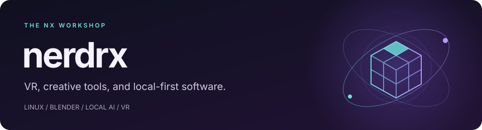

I build the **NX family**: VR streaming experiments, avatar materials, Blender tools, and apps that run on your own hardware. The projects range from GPU video codecs to everyday desktop utilities.

## NX Shader Graph

Build custom VRChat materials with nodes in Unity. Toon and PBR shading, fur, glitter, holograms and animated effects—with live previews while you work.

**Early alpha.** Developed on Linux for Unity 2022.3.22f1 and PC Built-In. Headset and VRChat client validation is still ahead.

[**Try NXSG**](https://nerdrx.github.io/nxsg/#install) · [See the material examples](https://nerdrx.github.io/nxsg/#material-studies) · [Source and progress](https://github.com/nerdrx/nxsg)

Raymarching nodes were introduced in alpha26, and the study graphs are included in alpha27. [Explore the raymarching examples](https://nerdrx.github.io/nxsg/#raymarching).

## From the workshop

| Project | What I’m building |
| :--- | :--- |
| **[NXSG](https://github.com/nerdrx/nxsg)** | A node editor for custom VRChat materials: fur, lighting, layers and animation. **Early alpha.** |
| **[NX Hub](https://github.com/nerdrx/nx-hub)** | One place to install, update, and launch the NX app family. |
| **[NX Warp](https://github.com/nerdrx/nx-warp)** | A Vulkan compute video codec exploring low-latency VR streaming. **Pre-alpha research.** |
| **[NX Recall](https://github.com/nerdrx/nx-recall)** | Local speech transcription, speaker identity, and searchable conversation history. [**Linux download.**](https://github.com/nerdrx/nx-recall/releases/latest) |
| **[NX Loom](https://github.com/nerdrx/nx-loom)** | A Blender addon where you draw the edge flow and generate a quad mesh from it. |
| **[NxTakt](https://github.com/nerdrx/nxtakt)** | A native Linux music workstation built around clips, scenes, and live performance. |
| **[QuadForge](https://github.com/nerdrx/quadforge)** | Automatic retopology for Blender, with adaptive density, guide curves, and symmetry. |

## Follow the builds

Follow **[@nerdrx](https://github.com/nerdrx)** to keep up with the workshop. For build notifications, open a project and choose **Watch → Custom → Releases**.

Tried a build, found a bug, or have a feature idea? Open an issue in the relevant project. Specific feedback helps shape what comes next.

Rust · C++ · Python · JavaScript / TypeScript · Kotlin · Linux &amp; Wayland
